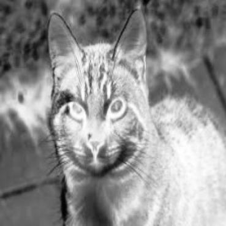
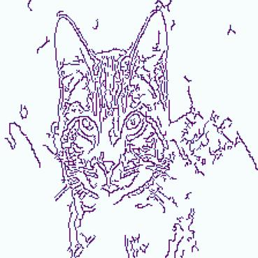

# RGB Augmentation
원본 color image로부터 RGB-depth, thermal, event 이미지를 생성한다.  
결과 이미지는 각각 dataset/${category}/depth,thermal,event에 저장된다.

### Data Structure

```
-- dataset
  -- animal_data
    -- Cat
      |--Cat_1.jpg
      |--Cat_2.jpg
      ...
    -- Dog
    ...
  -- depth
    -- Cat
      |--Cat_1.jpg
      |--Cat_2.jpg
      ...
    -- Dog
    ...
  -- event
    ...
  -- thermal
    ...
```

## Background
ViPT(Vision Prompt Multi-Modal Tracking)를 학습, 테스트할 때,  
RGB-D,T,E 각각 다른 데이터셋으로 따로 진행해야 하는 불편함이 있었다.  
따라서 같은 이미지에 대한 RGB-D, T, E 이미지를 사용 가능하도록 코드를 구현하였다.

## RGB Image
### Original Image
color image
<center></center>

example output - D,T,E 순서
<center></center>
<center></center>
<center></center>
